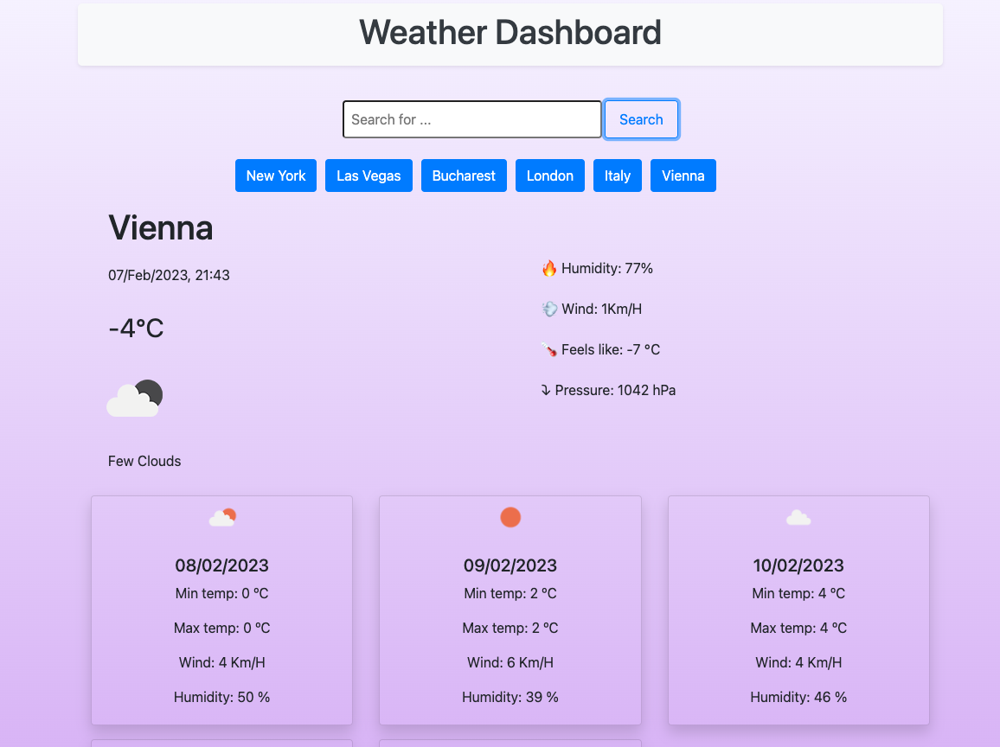

# Weather-Forecast
Weather dashboard that will run in the browser and feature dynamically updated HTML and CSS.

## User Story

```text
AS A traveler
I WANT to see the weather outlook for multiple cities
SO THAT I can plan a trip accordingly
```

## Description

This is a weather app that uses the OpenWeather API to display the current weather and a five-day forecast for a given location. The app displays information such as temperature, weather description, humidity, wind, feels like, and pressure. The location search history is stored in the local storage and can be displayed on the page. The app is built using jQuery and Moment.js.

## Step by step guide:
* Run the link in your browser.
* Input the name of the city you want to search for in the search bar.
* Click the search button to get the current weather information for the city.
* The current weather information will be displayed including the temperature, weather description, humidity, wind, and pressure.
* The weather forecast for the next 5 days will also be displayed.
* To search for a different city, simply repeat steps 3-6.
* The search history will be saved and displayed in the history section.

## Usage
;

Deployed link: https://superlative-mooncake-eaecf4.netlify.app/


## Credits
N/A

## License
Check License file for details in the repository